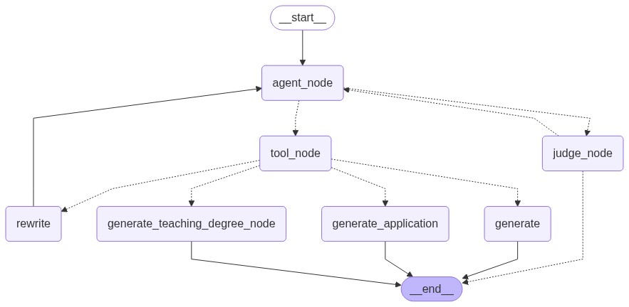
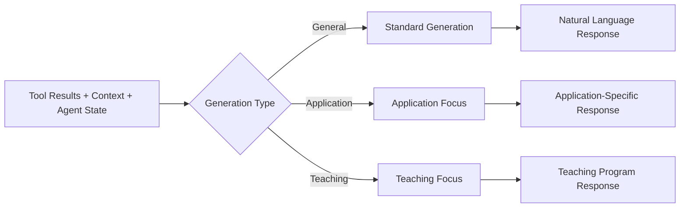

# Bot Architecture

The ask.UOS chatbot uses a **state-based graph architecture** implemented with LangGraph for decision-making and conversation flow management.

## AI Agent Framework

### Graph-Based Decision Engine

## Core Nodes

### 1. Agent Node

**Purpose**: Central decision-making hub

**Responsibilities**:
- Analyze user input and conversation context
- Decide between tool usage and direct response
- Maintain conversation state and history

**Flow**: Receives user input → Processes with LLM → Returns decision with tool calls or direct response

### 2. Tool Node

**Purpose**: Execute external tools and gather information

**Available Tools**:
- **Document Retrieval**: Vector search in Milvus database
- **Web Search**: Real-time web scraping and content extraction

**Process**: Parse tool calls → Execute with error handling → Format results → Update state

### 3. Judge Node

**Purpose**: Quality control and decision validation

**Evaluation Criteria**:
- Makes sure that the agent is in the capacity to answer a question without consulting the tools. This strategy should reduce Hallucinations. 

**Output**: Binary scoring with justification for routing decisions

### 4. Generate Nodes

#### Standard Generate
- Purpose: General response generation
- Input: Tool results and conversation context
- Output: Natural language response with sources

#### Application Generate
- Purpose: University admission process responses
- Input: Tool results and conversation context
- Specialization: Application deadlines, requirements, procedures

#### Teaching Degree Generate
- Purpose: Teacher training program responses  
- Input: Tool results and conversation context
- Specialization: Application deadlines, requirements, procedures

### 5. Rewrite Node

**Purpose**: Query optimization and reformulation

**Triggers**: Poor document relevance, insufficient results

**Process**: If documents are irrelevant to the user's query; instruct the agent to generate a new query and evaluate its previous tool usage. 

## State Management

### Document Retrieval Tool

**Function**: University document search in vector database

**Features**:
- L2 distance similarity search
- Program-specific filtering
- Source attribution with page references

### Web Search Tool

**Function**: Real-time web content retrieval and processing

**Features**:
- Asynchronous crawling
- To reduce wating times, pages are only scraped when the content has changed
- Content summarization
- Result caching
- Error handling and fallback strategies

**Process Flow**: Query construction → Cache lookup → Web crawling → Content extraction → Summarization

## Conversation Management

### Memory Handling

- Message history is limited (default: 7 messages)
- Summarization is triggered when token limits are reached
- Summaries replace older message segments to maintain context

### Context Preservation

- System messages are validated to ensure proper context
- Summarization maintains continuity in long conversations

---

## Performance Optimization

### Token Management

- Total token usage is monitored across the conversation
- Summarization is triggered as limits (token limits) are approached
- Context preservation is balanced with performance

### Caching Strategy

- Session state: In-memory conversation data
- Redis cache: Web scraping results and processed content

---

## Error Handling

### Graph Execution Errors

- Recursion limits are enforced to prevent infinite loops
- Fallbacks are used for tool failures and search errors
- Quality assurance checks for grounded responses and source attribution

---

## Core Architecture Objective

The core architecture of ask.UOS is designed to:
- Route user queries through a state-based graph for decision-making
- Integrate external tools for document and web search
- Maintain conversation context and optimize performance
- Ensure error handling and quality assurance

---

**Next**: [Components →](/docs/components/chat-interface.md)