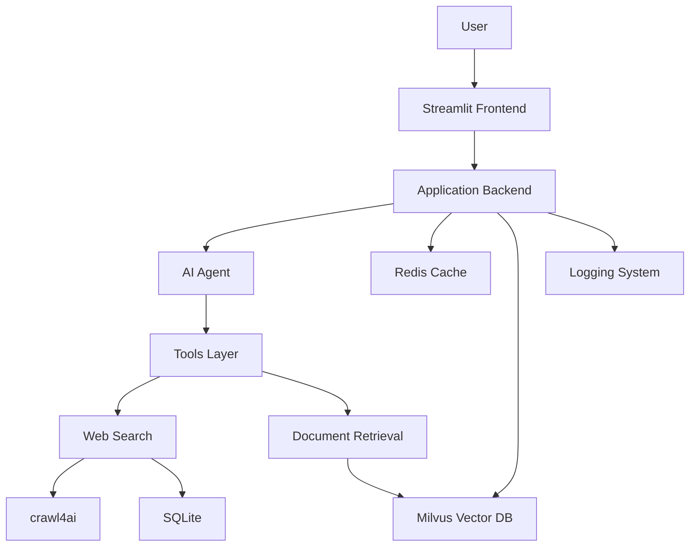

# Architecture Overview

ask.UOS uses a multi-layered architecture with modular components, asynchronous processing, and multiple storage layers.

## High-Level Architecture

## System Layers

- Presentation: Streamlit web application
- Application: Business logic and orchestration
- AI Agent: Decision engine
- Data: Redis, Milvus, SQLite
- Infrastructure: Docker Compose

## Service Architecture

- Web: Frontend application
- Redis: Caching and sessions
- Milvus: Vector database
- etcd: Metadata storage
- MinIO: Object storage

## Data Flow

- Session data: Redis
- Vector data: Milvus
- Cache data: Redis
- Logs: Files

---

**Next**: [Software Architecture →](bot.md)
