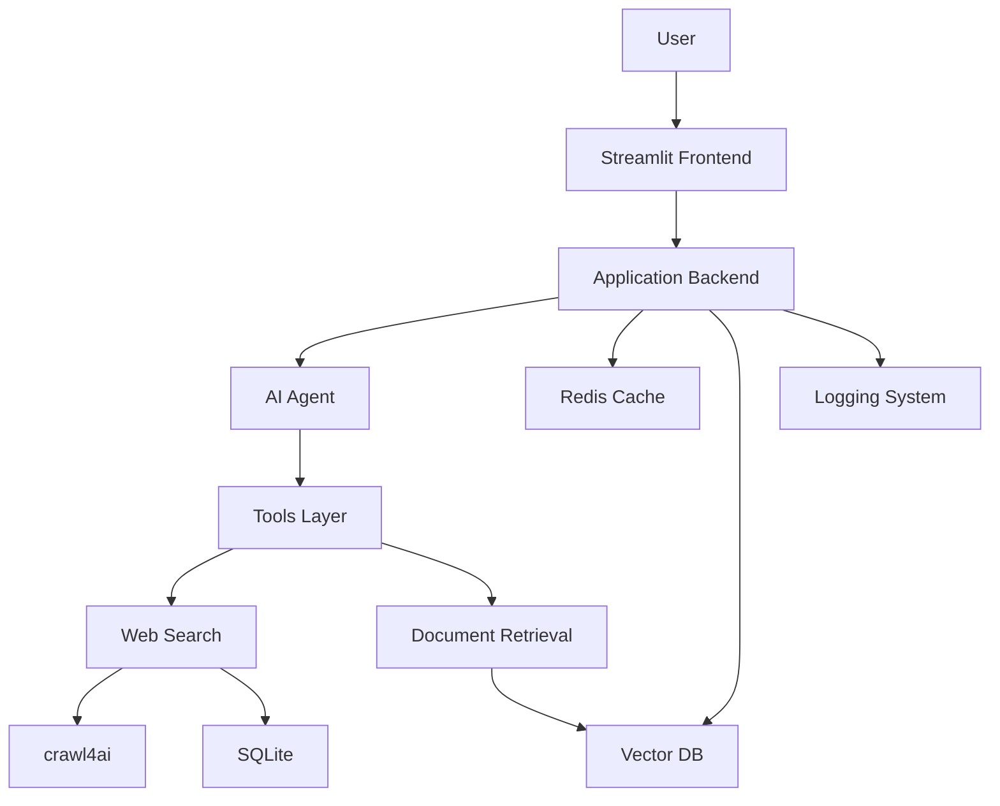

# Architecture Overview

ask.UOS uses a multi-layered architecture with modular components, asynchronous processing, and multiple storage layers.

## High-Level Architecture

```mermaid
graph TB
    User[User] --> Frontend[Streamlit Frontend]
    Frontend --> Backend[Application Backend]
    Backend --> AI[AI Agent]
    Backend --> Cache[Redis Cache]
    Backend --> DB[Vector DB]
    AI --> Tools[Tools Layer]
    Tools --> WebSearch[Web Search]
    Tools --> DocRetrieval[Document Retrieval]
    DocRetrieval --> DB
    WebSearch --> Crawler[crawl4ai]
    WebSearch --> SQLite[SQLite]
    Backend --> Logs[Logging System]
```

## System Layers

- Presentation: Streamlit web application
- Application: Business logic and orchestration
- AI Agent: Decision engine
- Data: Redis, RAGFlow, SQLite
- Infrastructure: Docker Compose

## Service Architecture

- Web: Frontend application
- Redis: Caching and sessions
- RAGFlow: Document Engine
- Backed exposes a `/v1/completions` endpoint for the AI agent.

---

**Next**: [Software Architecture →](bot.md)
