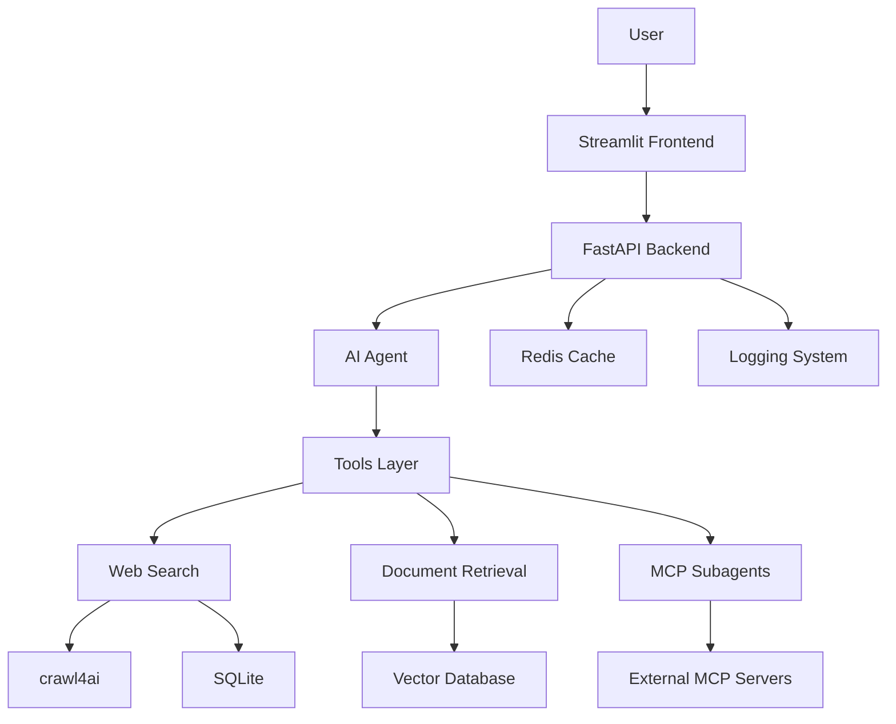

# Architecture Overview

ask.UOS uses a multi-layered architecture with modular components, asynchronous processing, and multiple storage layers.

## High-Level Architecture

```mermaid
graph TB
    User[User] --> Frontend[Streamlit Frontend]
    Frontend --> API[FastAPI Backend]
    API --> AI[AI Agent]
    API --> Cache[Redis Cache]
    AI --> Tools[Tools Layer]
    Tools --> WebSearch[Web Search]
    Tools --> DocRetrieval[Document Retrieval]
    Tools --> MCP[MCP Subagents]
    DocRetrieval --> VectorDB[Vector Database]
    MCP --> External[External MCP Servers]
    WebSearch --> Crawler[crawl4ai]
    WebSearch --> SQLite[SQLite]
    API --> Logs[Logging System]
```

The Streamlit frontend never talks to the AI agent directly — every request goes through the FastAPI backend's `/v1/chat/completions` streaming endpoint (which therefore OpenAI Compatible). The AI Agent box is the LangGraph engine; the Vector Database box is RAGFlow/Infinity (current) or Milvus (also supported).

## System Layers

- Presentation: Streamlit web application (thin HTTP client)
- Application: FastAPI backend — business logic and orchestration
- AI Agent: LangGraph decision engine, including MCP subagent dispatch
- Data: Redis, RAGFlow/Infinity (current) or Milvus (also supported), SQLite
- Infrastructure: Docker Compose

## Service Architecture

- `app`: Streamlit UI + FastAPI backend (same container)
- `redis`: Caching and sessions
- `crawl4ai`: Web scraping service
- RAGFlow/Infinity (or Milvus, if configured): run separately, not part of this app's compose file
- MCP servers: per-university, externally hosted integrations declared in `backend_config.yaml`

## Data Flow

- Session data: Redis
- Vector/document data: RAGFlow/Infinity or Milvus
- Cache data: Redis
- Logs: Structured JSON, per-replica files + stdout

---

**Next**: [Software Architecture →](bot.md)
