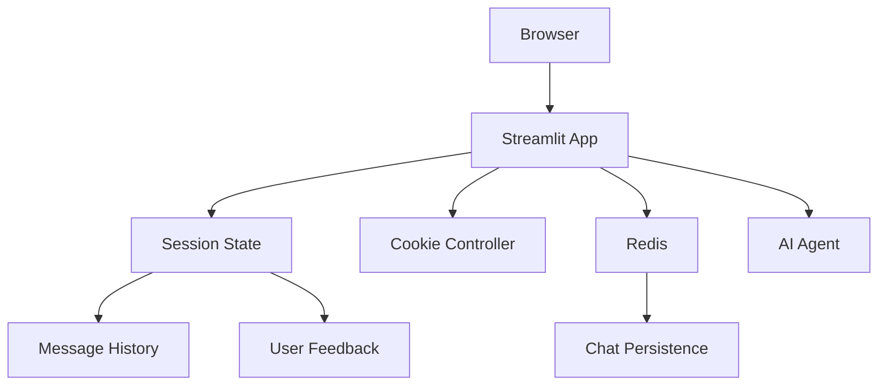

# Chat Interface

The chat interface is built with Streamlit for interactive conversations.

## Architecture Overview

## Core Components

- Singleton pattern for session management
- UUID-based user identification
- Redis-based message persistence
- Real-time chat display with avatars
- Multilingual support
- Feedback collection system
- Warning and disclaimer management

## Session Management

- Session state stores user ID, messages, agent instance, and UI state
- Summarization maintains context in long conversations

## Response Generation

- Streaming responses for real-time display
- Source attribution for document and link references

---

**Next**: [Deployment →](/docs/deployment/docker.md)