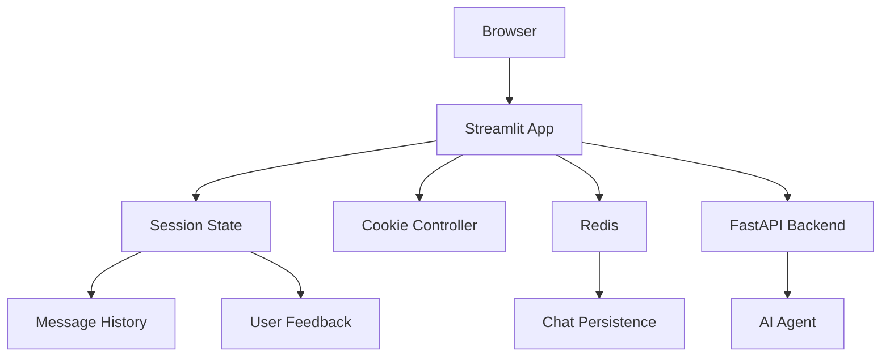

# Chat Interface

The chat interface is built with Streamlit for interactive conversations.

## Architecture Overview

```mermaid
graph TB
    Browser[Browser] --> Streamlit[Streamlit App]
    Streamlit --> Session[Session State]
    Streamlit --> Cookies[Cookie Controller]
    Streamlit --> Redis[Redis]
    Streamlit --> API[FastAPI Backend]
    API --> Agent[AI Agent]
    Session --> Messages[Message History]
    Session --> Feedback[User Feedback]
    Redis --> ChatHistory[Chat Persistence]
```

The Streamlit app is a thin HTTP client: it calls the FastAPI backend's `/v1/chat/completions` rather than invoking the agent in-process. The AI Agent box is the LangGraph engine.

## Core Components

- Singleton pattern for session management
- UUID-based user identification
- Redis-based message persistence
- Real-time chat display with avatars
- Multilingual support
- Feedback collection system
- Warning and disclaimer management

## Session Management

- Session state stores user ID, messages, and UI state
- Conversation history/context is maintained server-side by the FastAPI backend and the LangGraph checkpointer (Redis-backed), keyed by `thread_id`

## Response Generation

- Streaming responses for real-time display
- Progress narration: while a turn is still generating, randomized status text (e.g. "searching the web") is shown based on status codes the backend emits mid-stream
- Source attribution for document and link references

---

**Next**: [Deployment →](/docs/deployment/docker.md)