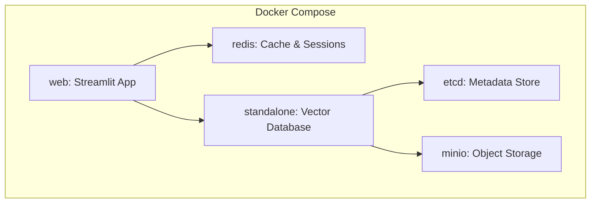

# Docker Setup

ask.UOS uses Docker Compose for orchestrating services in development and production.

## Container Architecture

## Service Definitions

- Web: Streamlit application
- Redis: Caching and sessions
- Milvus: Vector database
- etcd: Metadata storage
- MinIO: Object storage

## Setup Steps

- Build and start services with Docker Compose
- Configure environment variables for API keys and endpoints

---

**Next**: [Configuration →](/docs/configuration.md)
