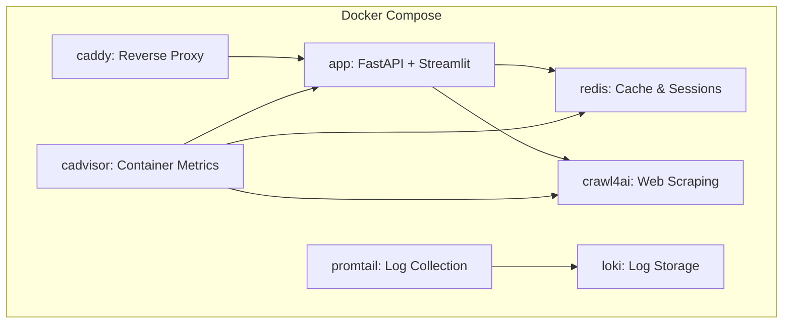

# Docker Setup

ask.UOS uses Docker Compose for orchestrating services in production deployments.

## Container Architecture

```mermaid
graph TB
    subgraph "Docker Compose"
        App[app: FastAPI + Streamlit]
        Redis[redis: Cache & Sessions]
        Crawl4ai[crawl4ai: Web Scraping]
        Caddy[caddy: Reverse Proxy]
        Promtail[promtail: Log Collection]
        Loki[loki: Log Storage]
        Cadvisor[cadvisor: Container Metrics]
    end
    App --> Redis
    App --> Crawl4ai
    Caddy --> App
    Promtail --> Loki
    Cadvisor --> App
    Cadvisor --> Redis
    Cadvisor --> Crawl4ai
```

## Service Definitions

### Core Services

- **app**: Main application container running both FastAPI (port 8000) and Streamlit (port 8501)
  - Image: `ghcr.io/virtuos/askuos:1.0.1`
  - Uses `.env.prod` for environment configuration
  - Health check on Streamlit endpoint
  
- **redis**: Redis cache server for caching and session management
  - Configured with maxmemory policy (allkeys-lru)
  - Persistent data storage in `redis-data` volume
  
- **crawl4ai**: Web scraping service using unclecode/crawl4ai image
  - Exposes port 11235

### Optional Services

- **caddy**: Reverse proxy for HTTPS support
  - Requires Caddyfile configuration
  - Exposes ports 80 and 443
  
- **node_exporter**: System metrics exporter for Prometheus
  - Exposes host system metrics
  
- **promtail**: Log collection agent for Loki
  - Collects logs from Docker containers
  - Requires promtail-config.yml
  
- **loki**: Log aggregation and storage service
  - Stores logs from promtail
  
- **cadvisor**: Container resource monitoring
  - Exposes container metrics on port 8080

**Next**: [Configuration →](/docs/configuration.md)
