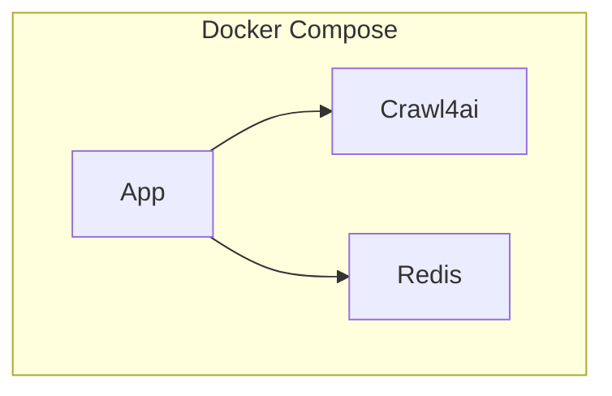

# Docker Setup

ask.UOS uses Docker Compose for orchestrating services in production deployments.

## Container Architecture

```mermaid
graph TB
    subgraph DockerCompose[Docker Compose]
        App[App]
        Crawl[Crawl4ai]
        Redis[Redis]
    end
    App --> Crawl
    App --> Redis
```

`App` is the `app` service (Streamlit UI + FastAPI backend, same container). `Crawl4ai` is the `crawl4ai` service (web scraping). `Redis` is the `redis` service (cache and sessions). RAGFlow/Infinity (or Milvus, if configured) run separately — they are not services in this app's `docker-compose.yml`.

## Service Definitions

- `app`: Streamlit UI + FastAPI backend, same container
- `crawl4ai`: Web scraping service used by the web search tool
- `redis`: Caching and sessions

## Setup Steps

- `cp src/backend_config_example.yaml src/backend_config.yaml` and `cp prompts_example prompts -r`
- Build and start services with Docker Compose

---

**Next**: [Configuration →](/docs/configuration.md)
