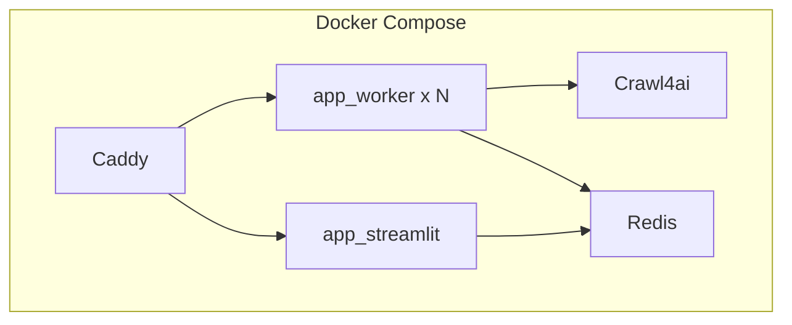

# Docker Setup

ask.UOS uses Docker Compose for orchestrating services in production deployments.

## Container Architecture

```mermaid
graph TB
    subgraph DockerCompose[Docker Compose]
        Caddy[Caddy]
        Streamlit[app_streamlit]
        Worker[app_worker x N]
        Crawl[Crawl4ai]
        Redis[Redis]
    end
    Caddy --> Streamlit
    Caddy --> Worker
    Worker --> Crawl
    Worker --> Redis
    Streamlit --> Redis
```

`app_streamlit` and `app_worker` are the Streamlit UI and FastAPI backend as separate services (see [`docker-compose.prod.example.yml`](../docker-compose.prod.example.yml)); the dev `docker-compose.yml` still runs both in one `app` container. `app_worker` runs with multiple replicas, load-balanced by `Caddy` (optional; see [`Caddy.example`](../Caddy.example)). `Crawl4ai` is the `crawl4ai` service (web scraping). `Redis` is the `redis` service (cache and sessions). RAGFlow/Infinity (or Milvus, if configured) run separately — they are not services in this app's compose file.

## Service Definitions

- `app_streamlit`: Streamlit UI, single replica
- `app_worker`: FastAPI backend, multiple replicas (`deploy.replicas`) behind the reverse proxy
- `caddy`: Optional reverse proxy, round-robin load balancing + health checks across `app_worker` replicas
- `crawl4ai`: Web scraping service used by the web search tool
- `redis`: Caching and sessions

## Setup Steps

- `cp docs/docker-compose.prod.example.yml ./docker-compose.yml` and, if using Caddy, `cp docs/Caddy.example ./Caddyfile` — edit both for your deployment (image tag, replica count, domain)
- `cp src/backend_config_example.yaml src/backend_config.yaml` and `cp prompts_example prompts -r`
- Build and start services with Docker Compose

---

**Next**: [Configuration →](/docs/configuration.md)
